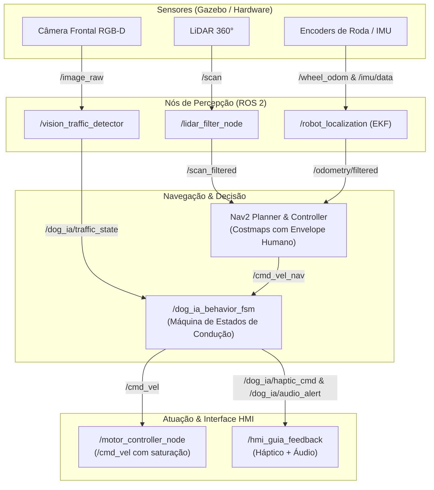

# Documento de Escopo Técnico do Projeto
# DOG-IA — Robô Cão-Guia Urbano de Inteligência Assistiva

---

## 1. Identificação do Projeto e Equipe

- **Nome Oficial do Projeto:** DOG-IA — Robô Cão-Guia Urbano de Inteligência Assistiva
- **Repositório Oficial no GitHub:** `https://github.com/guiviana128/DOG-IA_ROBO_CAO-GUIA`
- **Disciplina:** Robótica Móvel Inteligente
- **Instituição:** Centro Universitário FECAF
- **Integrantes da Equipe:**
  - **Gustavo Ribeiro dos Santos** — RA: **130363**
  - **Guilherme Viana** — RA: **104865**
- **Professor / Orientador:** Prof. Flávio Santarelli (`flavio.santarelli@pro.fecaf.com.br`)
- **Data da Versão:** 05 de Outubro de 2026 (Versão 1.0 — Start AC-3 / AC-4)

---

## 2. Contextualização e Justificativa do Problema

O deslocamento autônomo e seguro de pessoas com deficiência visual (PcD visual) nos centros urbanos contemporâneos apresenta desafios críticos. Calçadas irregulares, buracos, desníveis repentinos, veículos estacionados em locais indevidos e — principalmente — **obstáculos aéreos** (como lixeiras suspensas, orelhões, galhos de árvores e toldos baixos) representam riscos graves de acidentes que a bengala longa tradicional muitas vezes falha em prevenir.

O cão-guia biológico desempenha um papel extraordinário na mitigação desses riscos. Contudo, seu treinamento demanda anos de esforço altamente especializado, o custo de formação e manutenção atinge dezenas de milhares de reais, e a oferta cobre uma fração mínima (menos de 1%) da demanda de pessoas cegas no Brasil.

O projeto **DOG-IA** propõe uma plataforma robótica assistiva autônoma, escalável e de alto desempenho, construída sobre o ecossistema de robótica industrial **ROS 2**. O robô reproduz as funções cognitivas e de condução do cão-guia biológico:
1. **Varredura Contínua do Ambiente:** Detecção de obstáculos no solo e em elevação utilizando sensores LiDAR 360° e visão estéreo/profundidade.
2. **Reconhecimento Semântico Urbano:** Identificação de faixas de pedestres e estados de semáforos (verde/vermelho) através de redes neurais de visão computacional em tempo real.
3. **Envelope de Proteção Humana:** Planejamento de caminhos que consideram não apenas o corpo físico do robô, mas uma margem lateral estendida que garante passagem livre e segura para o usuário ao seu lado.
4. **Comunicação Multimodal com o Usuário:** Sinalização tátil-háptica na guia de condução aliada a avisos auditivos claros.

---

## 3. Objetivos do Projeto

### 3.1 Objetivo Geral
Modelar, simular, programar e validar uma plataforma robótica móvel cão-guia no ambiente de física 3D **Gazebo**, integrada ao middleware **ROS 2** e ao monitor de telemetria **RViz2**, capaz de navegar de forma autônoma e segura por rotas urbanas, transpor obstáculos e conduzir um pedestre cego com confiabilidade.

### 3.2 Objetivos Específicos
1. **Configuração de Infraestrutura de Alto Desempenho:** Estabelecer ambiente computacional baseado em Linux (Ubuntu 22.04 LTS / WSL2 + WSLg) com aceleração gráfica direta por GPU para garantir simulações 3D a 60 FPS estáveis.
2. **Modelagem URDF/SDF Realista:** Desenvolver o modelo físico e visual do robô com distribuição de massa, inércia, atrito das rodas/patas e disposição correta de todos os links e joints.
3. **Integração Sensorial em Microsserviços:** Configurar plugins de simulação para LiDAR 2D/3D (`/scan`), câmera RGB-D (`/camera/image_raw`), odometria de rodas (`/odom`) e sensor inercial (`/imu/data`).
4. **Visão Computacional Aplicada:** Implementar nó de detecção em tempo real para identificação de sinalização semafórica (`/dog_ia/traffic_light`) e faixas de travessia.
5. **Navegação Autônoma e Planejamento com Envelope Expandido:** Integrar o stack Nav2 com costmaps locais e globais dimensionados para acomodar a dupla robô-usuário.
6. **Máquina de Estados de Segurança (FSM):** Projetar arquitetura hierárquica de comportamentos que garanta parada imediata em emergências, travessia segura em sinal verde e desvio suave de pedestres e obstáculos dinâmicos.
7. **Documentação e Reprodutibilidade:** Garantir rastreabilidade integral no GitHub com documentação técnica e instruções passo a passo.

---

## 4. Arquitetura Conceitual em Microsserviços (ROS 2)

A arquitetura do DOG-IA abandona o paradigma de scripts monolíticos em favor de uma topologia de nós independentes, fracamente acoplados e altamente tolerantes a falhas:

### 4.1 Principais Tópicos e Mensagens

| Tópico | Tipo de Mensagem | Publicador | Assinante | Descrição |
| :--- | :--- | :--- | :--- | :--- |
| `/scan` | `sensor_msgs/msg/LaserScan` | Plugin LiDAR / Gazebo | `lidar_filter_node` | Leituras angulares de distância em 360°. |
| `/scan_filtered` | `sensor_msgs/msg/LaserScan` | `lidar_filter_node` | `nav2_costmap` | Nuvem de varredura tratada e livre de ruídos. |
| `/camera/image_raw` | `sensor_msgs/msg/Image` | Câmera Gazebo | `vision_traffic_detector` | Fluxo contínuo de vídeo da visão frontal. |
| `/dog_ia/traffic_state` | `std_msgs/msg/String` | `vision_traffic_detector` | `behavior_fsm` | Estado detectado do semáforo: `RED`, `GREEN`, `YELLOW` ou `UNKNOWN`. |
| `/odom` | `nav_msgs/msg/Odometry` | Plugin de tração | `robot_localization` | Estimativa cinemática de posição e velocidade. |
| `/cmd_vel` | `geometry_msgs/msg/Twist` | `behavior_fsm` | Atuador de motores | Velocidades linear $v$ (m/s) e angular $\omega$ (rad/s) validadas. |
| `/dog_ia/haptic` | `std_msgs/msg/UInt8` | `behavior_fsm` | Módulo da Guia | Padrões de vibração tátil na empunhadura (0: suave, 1: curva, 2: stop). |
| `/dog_ia/audio` | `std_msgs/msg/String` | `behavior_fsm` | Sintetizador de voz | Avisos verbais ao usuário (ex.: "Aguarde o sinal abrir", "Desviando à direita"). |

---

## 5. Infraestrutura Computacional & Pipeline de Simulação

Para viabilizar simulações de alta fidelidade física sem perda de desempenho, o projeto adota o seguinte ecossistema de software:

- **WSL2 com WSLg (Windows Subsystem for Linux GUI):** Permite a execução nativa do kernel Linux Ubuntu dentro do Windows 11. O WSLg realiza o repasse direto das chamadas gráficas via paravirtualização (driver vGPU / Direct3D 12), viabilizando taxas estáveis de 60 FPS nas janelas gráficas sem sobrecarregar a CPU.
- **Docker & DevContainers (Opcional para portabilidade):** Imagem padronizada contendo a distribuição ROS 2 e dependências exatas, garantindo que o ambiente seja idêntico entre os computadores de todos os membros do grupo.
- **Gazebo Simulator:** Responsável pelo motor de física rígida (ODE / Bullet / Dart), gravidade, atrito dinâmico entre pneus e asfalto, e simulação dos feixes ópticos do LiDAR e da câmera.
- **RViz2 (ROS Visualization):** Atua como a "visão interna" do robô, renderizando a grade de ocupação do mapa, o custo de colisão gerado ao redor dos obstáculos e a rota em tempo real.

---

## 6. Modelagem Cinemática e Envelope de Segurança Humana

Diferente de um robô de transporte comum, o robô cão-guia precisa proteger o humano que caminha à sua esquerda/direita. 

### 6.1 Cinemática Diferencial Inversa com Saturação
O comando de velocidade linear $v$ e angular $\omega$ gerado pela navegação é convertido para a velocidade das rodas esquerda ($v_e$) e direita ($v_d$):
$$v_e = v - \frac{\omega \cdot L}{2}$$
$$v_d = v + \frac{\omega \cdot L}{2}$$
Em caso de comandos que excedam o limite físico dos atuadores ($v_{max} = 1.5\text{ m/s}$), o nó atuador aplica uma saturação proporcional para preservar o raio de curvatura exato da manobra:
$$s = \frac{v_{max}}{\max(|v_e|, |v_d|)} \quad \text{se } \max(|v_e|, |v_d|) > v_{max}$$
$$v_e \leftarrow v_e \cdot s, \quad v_d \leftarrow v_d \cdot s$$

### 6.2 Polígono de Inflação (Costmap Expandido)
O footprint configurado no Nav2 incorpora a largura combinada do cão robô ($\approx 0.4\text{ m}$), da guia ($\approx 0.5\text{ m}$) e do usuário acompanhante ($\approx 0.6\text{ m}$), totalizando um raio de segurança de pelo menos $1.2\text{ m}$ na camada de inflação de obstáculos. Isso previne que o robô faça curvas raspando em postes ou muros onde o pedestre colidiria.

---

## 7. Requisitos do Sistema

### 7.1 Requisitos Funcionais (RF)
- **RF01:** O sistema deve manter comunicação contínua entre os nós de sensoriamento, percepção e controle através de tópicos ROS 2.
- **RF02:** O robô deve detectar obstáculos fixos e móveis a até $5.0\text{ m}$ de distância com o sensor LiDAR e frear a pelo menos $0.8\text{ m}$ de qualquer obstáculo.
- **RF03:** O sistema de visão deve classificar o estado do semáforo de pedestres (verde vs. vermelho) com acurácia superior a $90\%$ no ambiente simulado.
- **RF04:** O robô só deve iniciar a travessia de calçadas quando o semáforo estiver classificado como verde e a faixa estiver livre de veículos.
- **RF05:** O planejador local deve calcular rotas de desvio suaves, priorizando manobras que mantenham o pedestre na área segura da calçada.
- **RF06:** O módulo HMI deve acionar alertas hápticos imediatos (vibração na guia) em caso de desvio iminente ou parada repentina.
- **RF07:** A telemetria completa (posição odometria, leituras LiDAR e estado de controle) deve ser visualizável simultaneamente no RViz2.
- **RF08:** O sistema deve dispor de mecanismo de parada de emergência (*Heartbeat Fail-Safe*), travando as rodas se a comunicação com o planejador for interrompida por mais de $500\text{ ms}$.

### 7.2 Requisitos Não Funcionais (RNF)
- **RNF01 (Desempenho):** O loop de controle no tópico `/cmd_vel` deve operar a uma frequência mínima de $20\text{ Hz}$.
- **RNF02 (Latência):** O tempo entre a detecção de um obstáculo crítico no `/scan` e a emissão do comando de parada não deve exceder $100\text{ ms}$.
- **RNF03 (Fidelidade Gráfica):** A taxa de quadros no Gazebo e RViz2 deve ser mantida acima de $30\text{ FPS}$ utilizando aceleração por hardware (GPU).
- **RNF04 (Modularidade):** Cada funcionalidade principal deve estar encapsulada em seu próprio pacote ROS 2 independente.
- **RNF05 (Portabilidade):** O código deve ser compilável via `colcon build` tanto em distribuições nativas Ubuntu quanto em subsistemas WSL2.
- **RNF06 (Documentação):** O repositório Git deve manter histórico limpo de commits, documentação clara de launch files e diagramas de nós.

---

## 8. Cronograma e Marcos de Validação (AC-3 e AC-4)

| Fase | Etapa | Descrição das Atividades | Previsão | Status |
| :--- | :--- | :--- | :--- | :--- |
| **AC-3** | **Etapa 1** | Formação do grupo, repositório GitHub oficial, documentação de escopo, setup do workspace e testes de simulação. | 05/10/2026 | **Concluído (0,25 pt)** |
| **AC-3** | **Etapa 2** | Criação do modelo URDF/Xacro do robô, colisão, inércias e plugins de sensores no Gazebo. | Out/2026 | Planejado |
| **AC-3** | **Etapa 3** | Implementação dos nós de visão (semáforo) e filtragem de ruído do LiDAR. | Out/2026 | Planejado |
| **AC-4** | **Etapa 4** | Configuração do stack de navegação Nav2 com costmaps e envelope do pedestre. | Nov/2026 | Planejado |
| **AC-4** | **Etapa 5** | Máquina de estados (FSM) de condução assistiva e testes em cenário urbano no Gazebo. | Nov/2026 | Planejado |
| **AC-4** | **Etapa Final** | Apresentação ao vivo, validação completa das telas de simulação e entrega do relatório final. | Dez/2026 | Planejado |
